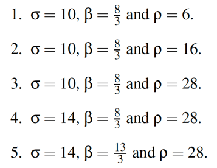

# Scientific Computing using Python-I

#### Authors:
1. Kashif Rabbani - kashifrabbani@cs.aau.dk
2. Imran Riaz - imranh@cs.aau.dk


#### How to run the test cases?
Execute the following shell script file:
```sh
test_cases/execute_all_cases.sh
```

It will run all the test cases and show the following output using the given values of each test case.

```

Executing case 1.
Initiated Case # 1 ...

N: 10000, Time Interval: 0.02, and x , y, z = 1
Simulating...
Time elapsed: 7.706 ms
Writing...
Time elapsed: 29.733 ms
Plotting 3D...
Time elapsed: 12669.492 ms
Plotting 2D - xy...
Time elapsed: 8879.451 ms
Plotting 2D - xz...
Time elapsed: 9035.807 ms
Plotting 2D - yz...
Time elapsed: 8564.953 ms

Executing case 2.
Initiated Case # 2 ...

N: 10000, Time Interval: 0.02, and x , y, z = 1
Simulating...
Time elapsed: 8.856 ms
Writing...
Time elapsed: 28.339 ms
Plotting 3D...
Time elapsed: 11896.999 ms
Plotting 2D - xy...
Time elapsed: 8676.218 ms
Plotting 2D - xz...
Time elapsed: 9153.993 ms
Plotting 2D - yz...
Time elapsed: 10330.760 ms

Executing case 3.
Initiated Case # 3 ...

N: 10000, Time Interval: 0.02, and x , y, z = 1
Simulating...
Time elapsed: 10.438 ms
Writing...
Time elapsed: 39.616 ms
Plotting 3D...
Time elapsed: 11866.982 ms
Plotting 2D - xy...
Time elapsed: 8703.523 ms
Plotting 2D - xz...
Time elapsed: 9243.750 ms
Plotting 2D - yz...
Time elapsed: 10348.818 ms

Executing case 4.
Initiated Case # 4 ...

N: 10000, Time Interval: 0.02, and x , y, z = 1
Simulating...
Time elapsed: 7.742 ms
Writing...
Time elapsed: 28.012 ms
Plotting 3D...
Time elapsed: 11802.349 ms
Plotting 2D - xy...
Time elapsed: 9360.399 ms
Plotting 2D - xz...
Time elapsed: 9627.141 ms
Plotting 2D - yz...
Time elapsed: 10469.431 ms

Executing case 5.
Initiated Case # 5 ...

N: 10000, Time Interval: 0.02, and x , y, z = 1
Simulating...
Time elapsed: 7.708 ms
Writing...
Time elapsed: 34.675 ms
Plotting 3D...
Time elapsed: 12556.372 ms
Plotting 2D - xy...
Time elapsed: 8992.390 ms
Plotting 2D - xz...
Time elapsed: 9249.509 ms
Plotting 2D - yz...
Time elapsed: 10370.544 ms

```

Once the execution is completed, you can check the results directory to see the output of each test case.
- On Github, click [here](https://github.com/Kashif-Rabbani/SCP-1-Solution/tree/main/result) to go to results directory
- Locally you can look for the following directory path:
    ```sh
        SCP-1-Solution/result
     ```
